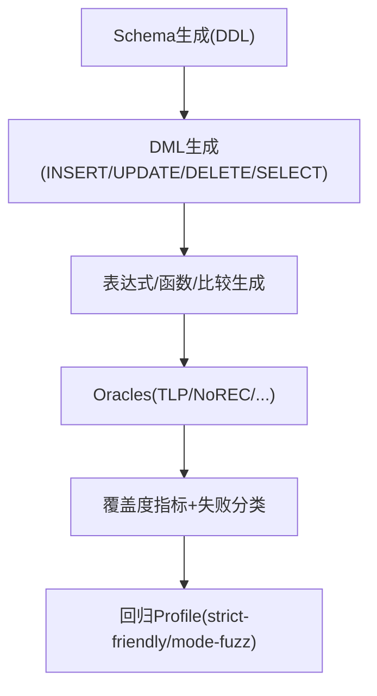

# SQLancer 增强设计：MySQL 日期时间类型全覆盖（DDL + DML）

## 背景与动机

当前 SQLancer 的 MySQL 方言对日期时间类型的支持存在不完整与“被动出现”的问题：在部分日志/反射结果中可见 `DATE`、`TIME(n)`、`TIMESTAMP(n)`，但核心生成逻辑未系统覆盖 `DATETIME`、`YEAR`，且 DML 生成未必会真实触达日期列。

本设计旨在让 SQLancer 在 MySQL 8.0 上对 **全部日期时间类型**实现可控、可度量、可回归的覆盖，尤其要确保：

- **CREATE TABLE** 一定包含日期类型列（不是“可能包含”）
- **各类 DML**（INSERT/UPDATE/DELETE/SELECT）一定会读/写日期类型（不是“表里有列但语句没用到”）

参考文档：
- MySQL 8.0 日期与时间类型概述（含“零值”行为、输入解析、严格模式影响等）：[MySQL :: 13.2 Date and Time Data Types](https://dev.mysql.com/doc/refman/8.0/en/date-and-time-types.html)

---

## 目标

- **类型全覆盖**：`DATE`、`TIME[(fsp)]`、`DATETIME[(fsp)]`、`TIMESTAMP[(fsp)]`、`YEAR`
- **DDL 覆盖**：表生成器可稳定生成包含上述类型列的建表语句，并覆盖合理的列属性组合（NULL/NOT NULL、DEFAULT、自动初始化/更新相关组合的受控子集）。
- **DML 覆盖**：INSERT/UPDATE/DELETE/SELECT 每类语句在生成时都必须触达至少一个日期族列（读或写），并在全局保证五种类型都被 DML 触达。
- **语义覆盖**：覆盖 MySQL 文档强调的关键语义点：
  - “零值”与不完整日期（`0000-00-00`、`YYYY-00-00`、`YYYY-MM-00` 等）在不同 SQL mode 下的差异
  - 输入解析的容忍度（多格式输入、但日期顺序必须 year-month-day）
  - 小数秒精度 `fsp`（0–6）的生成与边界行为
  - 日期/时间与字符串、数值上下文中的隐式转换及其对比较/排序/函数的影响
- **可度量**：提供覆盖度指标与失败分类，能量化“支持提升”而非仅凭运行感觉。

---

## 非目标（本期不做/不强做）

- **时区 fuzz**：本期默认固定 `time_zone`（建议 UTC）。跨时区随机化作为后续独立实验，否则 `TIMESTAMP` 容易引入非确定性噪声。
- **全量日期函数覆盖**：本期先实现“高覆盖、低失败率”的函数集合；更复杂/高噪声函数逐步引入并分配较低权重。
- **把所有 SQL mode 组合都混进默认 profile**：对严格模式与零值/不完整日期的 fuzz 采用 profile 隔离，避免主线回归被大量预期拒绝淹没。

---

## 关键语义点（来自 MySQL 文档，必须在测试中覆盖）

- **零值（Zero values）**：
  - `DATE`：`'0000-00-00'`
  - `DATETIME/TIMESTAMP`：`'0000-00-00 00:00:00'`
  - `TIME`：`'00:00:00'`
  - `YEAR`：`0000`
  - 在严格/NO_ZERO_DATE/NO_ZERO_IN_DATE 等 SQL mode 下可能产生 warning 或 error；需要 profile 化。
- **输入解析**：
  - MySQL 会尝试解析多种输入格式，但日期顺序必须 year-month-day；其他顺序需要 `STR_TO_DATE()`。
- **隐式转换**：
  - 日期/时间在数值上下文会被自动转换为数值，反之亦然；比较与表达式重写可能因隐式转换不同产生差分。
- **不完整日期**：
  - 允许存储 `YYYY-00-00`、`YYYY-MM-00`（默认模式下），但很多日期函数在不完整日期上不保证“正确”结果；因此这类用例更适合放到 fuzz profile，避免作为主 oracle 的核心信号。
- **`fsp` 小数秒精度**：
  - `TIME/DATETIME/TIMESTAMP` 的 `fsp` 范围为 0–6，需覆盖无 fsp 与极值 fsp（如 6）。

---

## 总体方案概览

本增强按“生成能力 → 语义覆盖 → oracle 放大差异 → 回归度量”推进，并通过 **两套 profile** 把“稳定主线覆盖”与“模式/零值差异探索”隔离开。



---

## 设计细节

### A. Schema / DDL 生成（CREATE TABLE）

#### A1. 类型枚举与映射补齐

- 增加 `DATETIME`、`YEAR` 到核心类型系统（枚举/解析/反射映射一致）。
- 明确 `TIME/DATETIME/TIMESTAMP` 的 `(fsp)` 表示与缺省形式。

#### A2. DDL 强制覆盖策略（硬约束）

为避免“运气好才出现日期列”，引入硬约束：

- **表级硬约束**：每张生成的表至少包含 1 个日期族列
- **schema 级硬约束**：每轮/每个 schema 生成的所有表中，`DATE/TIME/DATETIME/TIMESTAMP/YEAR` 五类至少各出现一次
- **更强默认（建议）**：每张表包含 2–3 个日期族列（随机选不同类型），加速覆盖并降低“单列缺失”概率

#### A3. `fsp` 覆盖策略

- `fsp` 取值范围：0–6
- 分层抽样（推荐默认）：
  - 高频：无 fsp、`(0)`、`(3)`、`(6)`
  - 低频：随机 1–6

#### A4. 列属性组合（受控白名单）

- **NULL/NOT NULL**：混合生成，避免所有日期列都 NOT NULL 导致插入压力过大
- **DEFAULT**：
  - 常量默认（严格模式 profile 使用完整合法日期；fuzz profile 才启用零值/不完整日期默认）
  - `DEFAULT CURRENT_TIMESTAMP[(fsp)]`（仅对 `TIMESTAMP/DATETIME` 按 MySQL 规则生成）
- **ON UPDATE**：
  - 对 `TIMESTAMP/DATETIME` 采用白名单组合（例如仅允许与 `CURRENT_TIMESTAMP` 搭配），避免生成大量“可解析但高拒绝/高噪声”的组合

---

### B. DML 生成（必须触达日期列）

#### B0. DML 总硬规则（核心）

为确保“各类 DML 都包含日期类型”，引入全局硬规则：

- **INSERT**：必须写入至少 1 个日期族列
- **UPDATE**：必须更新至少 1 个日期族列，且 WHERE 中必须包含日期谓词
- **DELETE**：WHERE 中必须包含日期谓词（触达日期比较/隐式转换路径）
- **SELECT**：必须在以下位置至少一个触达日期族列：`SELECT 列表` / `WHERE 或 HAVING` / `ORDER BY` / `GROUP BY`
- **全局覆盖约束**：在一定窗口（例如每 N 条语句或每轮测试）内，保证五种类型都被 DML 触达（读/写至少一次）

> 注：该规则应在生成阶段强制，而非运行后统计“发现没覆盖再补救”。

#### B1. INSERT 设计

覆盖写入形态：

- 字面量写入：`'YYYY-MM-DD'`、`'HH:MM:SS[.fraction]'`、`'YYYY-MM-DD HH:MM:SS[.fraction]'`
- 函数写入：`CURRENT_TIMESTAMP[(fsp)]` / `NOW[(fsp)]`（与固定 `time_zone` 配套）
- 转换写入（低权重）：`CAST(string AS DATETIME)`、`STR_TO_DATE(...)`

值分布（按 profile 控制）：

- strict-friendly：只生成完整合法日期/时间，减少无意义拒绝
- mode-fuzz：注入零值与不完整日期输入，触发 SQL mode 差异

#### B2. UPDATE 设计
 
覆盖两类路径：**更新日期列** + **使用日期谓词过滤**。

- **SET 子句（必须触达日期族列）**：
  - 直接赋值：`col = <literal_or_function>`
  - 自引用变换：`col = DATE_ADD(col, INTERVAL k unit)` / `DATE_SUB(...)`
  - 受控转换：`col = CAST(<string_expr> AS DATETIME)`（低权重，降低失败率）
- **WHERE 子句（必须包含日期谓词）**：
  - 比较：`date_col < literal`、`dt_col >= literal`
  - 范围：`BETWEEN a AND b`
  - 集合：`IN (v1, v2, ...)`
  - NULL/零值相关：`IS NULL`、`= '0000-00-00'`（仅 mode-fuzz）

#### B3. DELETE 设计

- **WHERE 必含日期谓词**：至少一个谓词引用日期族列（同 UPDATE 的 WHERE 族）。
- **与索引/排序的交叉覆盖（可选）**：结合 `ORDER BY date_col LIMIT n` 形式（若生成器支持），放大排序与比较语义覆盖。

#### B4. SELECT 设计

SELECT 是主 oracle 的承载体，需要在投影/谓词/排序/聚合中系统触达日期类型。

- **硬约束**：每条 SELECT 至少触达一个日期族列（以下四个位置之一即可）：
  - SELECT 列表：直接选列或日期表达式
  - WHERE/HAVING：日期谓词
  - ORDER BY：日期列排序
  - GROUP BY：对日期列或日期表达式分组
- **推荐的最小函数集合（第一批）**：
  - `CAST/CONVERT`
  - `EXTRACT(unit FROM <temporal>)`
  - `DATE_ADD/DATE_SUB`（或等价 `+ INTERVAL` 形式）
- **第二批（更易引入噪声，降权并 profile 控制）**：
  - `STR_TO_DATE`（覆盖“多格式输入但需显式解析”）
  - `DATE_FORMAT`
  - `TIMESTAMPDIFF`

---

### C. 表达式、比较与隐式转换覆盖

#### C1. 跨类型比较策略

为覆盖 MySQL 的隐式转换与类型提升，设计比较组合（按权重从高到低）：

- 同类比较：`DATE` vs `DATE`，`DATETIME` vs `DATETIME`，`TIME` vs `TIME`，`TIMESTAMP` vs `TIMESTAMP`，`YEAR` vs `YEAR`
- 近邻跨类比较：
  - `DATE` vs `DATETIME`
  - `DATETIME` vs `TIMESTAMP`（注意时区固定）
- 与字符串/数值的比较（低权重）：
  - `date_col = '2026-04-07'`
  - `dt_col > 20260407123456`（仅用于覆盖“数值上下文自动转换”，避免作为默认主力）

#### C2. 零值/不完整日期的使用边界

依据文档提示：不完整日期在部分函数上不保证合理语义，因此：

- strict-friendly：默认不生成零值/不完整日期输入，避免把“预期拒绝/不可靠函数结果”当 bug 信号
- mode-fuzz：系统化覆盖零值/不完整日期，作为“模式差异与健壮性”测试源

---

### D. Oracles（差分放大策略）

日期类型最容易在“隐式转换、`fsp` 舍入、零值与 SQL mode、时区”上产生差分；oracle 设计需要放大这些差异，同时控制非确定性。

#### D1. 推荐 oracle 组合

- **TLP（True/False/NULL Partitioning）**：
  - 适合日期谓词（`<`, `BETWEEN`, `IS NULL`）的语义一致性检验
- **NoREC**：
  - 适合聚合/过滤在包含日期表达式时的等价重写一致性检验
- **（可选）Pivot/分组类 oracle**：
  - 让日期列参与 `ORDER BY/GROUP BY`，检出排序/分组边界差异

#### D2. 非确定性控制（强烈建议默认启用）

- 固定 `time_zone`（建议 `+00:00` 或 `UTC`），否则 `TIMESTAMP` 涉及隐式时区转换会引入噪声。
- 对 `NOW/CURRENT_TIMESTAMP` 的使用设置权重与场景白名单：
  - 主线 oracle 优先使用常量与列运算
  - 仅在专门场景覆盖“自动初始化/更新”相关语义

---

## 与现有 MySQL Test Oracle 的兼容性设计（必须）

MySQL 的日期类型增强必须与当前已支持的 test oracle **完全兼容**，并确保在不同 oracle 模式下都能稳定生成“包含日期类型”的 SQL，从而提升测试完备性。

### 兼容性基线：当前 MySQL Oracle 列表

MySQL 的 oracle 入口由 `MySQLOracleFactory` 提供，当前包含（节选）：

- TLP 家族：`TLP_WHERE`、`AGGREGATE`、`HAVING`、`GROUP_BY`、`DISTINCT`
- 重写/差分：`NOREC`
- Pivot：`PQS`（Pivoted Query Synthesis）
- 计划/统计：`CERT`
- 其他：`DQP`、`DQE`、`EET`、`CODDTEST`、`FUZZER`、`QUERY_PARTITIONING`（组合）

代码参考：
- `sqlancer-main/sqlancer-main/src/sqlancer/mysql/MySQLOracleFactory.java`

### Oracle 兼容性的核心约束（设计要求）

为确保“每个 oracle 都能生成日期类型 SQL”，需要在 **schema/数据生成** 与 **表达式生成** 两个层面同时施加约束：

1) **Schema 层**：所有 oracle 使用的 `getRandomTableNonEmptyTables()` 必须能返回包含日期列的表/列集合  
   - 方案：DDL 生成阶段的“schema 级硬约束”必须保证五类日期列存在于可被随机挑选的表中（且表非空，满足 `requiresAllTablesToContainRows()` 的 oracle）。

2) **表达式层**：所有复用 `MySQLExpressionGenerator` 的 oracle（TLP_WHERE、NOREC、CERT、PQS、DQP、DQE、CODDTEST 等）必须能：
   - 生成包含日期列的布尔谓词（WHERE/HAVING/ON）
   - 生成日期相关常量（用于比较、IN/BETWEEN、函数参数、插入/更新写入）
   - 生成对日期列可用的函数/运算（受控白名单 + 权重）

3) **值表示层（关键）**：PQS/CODDTEST 等 oracle 会把运行时结果（`ResultSet.getObject()`）转换为 `MySQLConstant`，并用于拼回 SQL（`getTextRepresentation()`）。因此必须补齐：
   - `MySQLConstant` 对 `DATE/TIME/DATETIME/TIMESTAMP/YEAR` 的常量表示与序列化
   - 行值抽取（rowValue）对 temporal 类型的读取与类型保持（避免全部退化成字符串导致比较/排序语义漂移）

### Oracle 逐项兼容性要求（按 SQL 形态）

下面按 oracle 的 SQL 形态列出“日期类型必须可被触达”的最低要求（用于实现与验收）：

- **TLP_WHERE（`TLPWhereOracle` + `MySQLExpressionGenerator`）**
  - WHERE 生成必须能产生：日期列参与比较/逻辑运算（含 NULL 分支）
  - 常量必须包含：日期/时间字面量（strict-friendly）与零值/不完整日期（mode-fuzz）

- **NOREC（`NoRECOracle` + `MySQLExpressionGenerator`）**
  - WHERE 谓词的重写（IF + SUM）中，日期谓词必须可生成且可执行
  - 避免高度非确定性函数（NOW/CURRENT_TIMESTAMP）作为默认谓词核心

- **TLP_AGGREGATE / HAVING / GROUP_BY / DISTINCT（`MySQLTLPBase` 派生）**
  - GROUP BY/HAVING 表达式中要能出现日期列或日期表达式（至少在一定比例内）
  - 需避免 MySQL UNION + ORDER BY 的语法限制（当前 base 已禁用 ORDER BY；日期增强不应引入该限制）

- **PQS（`MySQLPivotedQuerySynthesisOracle`）**
  - pivotRow 的 temporal 值必须能被无损地转为可拼接的 SQL 常量（`= <temporal_literal>`）
  - ORDER BY 的生成必须能安全包含 temporal 表达式（且不触发 MySQL 的 “ORDER BY <integer> 被当列位置”问题）

- **CERT（`CERTOracle` + `MySQLExpressionGenerator`）**
  - EXPLAIN 的查询生成与 WHERE 谓词一致：日期列参与的谓词必须可生成
  - 固定 `time_zone`，否则涉及 `TIMESTAMP` 的计划可能出现环境差异噪声

- **DQP / DQE**
  - DQP 的 hints/optimizer 变量校验需在包含日期列的查询上覆盖（至少一定比例）
  - DQE 的 whereClause 生成同样需要日期列参与；并注意 UPDATE/DELETE 的错误码策略可能受 sql_mode 影响（需在 mode-fuzz 下分流统计）

- **CODDTEST / EET / FUZZER**
  - 这些 oracle/模式往往会产生更复杂的表达式/子查询/聚合：日期常量与 temporal 值抽取必须健壮，否则容易退化为“全字符串比较”带来假阳性/假阴性。

### 验收标准（Oracle 兼容性维度）

在原有 DoD 基础上，增加“oracle 兼容性完备性”验收：

- **覆盖矩阵**：对 `MySQLOracleFactory` 中每个启用的 oracle，统计其最后 N 轮生成的 SQL 中是否出现日期族类型（至少满足其核心查询包含 temporal 列/常量/表达式之一）。
- **强制阈值**（建议默认）：
  - 每个 oracle：在 N=100 轮内，至少有 \(p\%\) 的查询包含 temporal 列引用（建议 p≥30%，PQS/CERT/TLP_WHERE/NOREC 可更高）
  - 每个 oracle：在 N=100 轮内，至少覆盖到 `DATE/TIME/DATETIME/TIMESTAMP/YEAR` 中的 ≥3 类；在更长窗口（如 N=500）覆盖到 5 类
- **稳定性**：strict-friendly 下各 oracle 的语法失败率与“模式拒绝”失败率维持在可接受水平（与 mode-fuzz 明确区分）

### Oracle → 需要改动的生成链路点位清单（落到代码）

本节把“每个 oracle 如何生成 SQL”展开到具体的生成链路点位，便于实施时逐个对齐、逐个验收。

#### 统一链路点位（所有 oracle 共享/复用的关键模块）

- **DDL 表结构生成**：`sqlancer-main/sqlancer-main/src/sqlancer/mysql/gen/MySQLTableGenerator.java`
  - 现状：`MySQLDataType` 仅包含 `INT/VARCHAR/FLOAT/DOUBLE/DECIMAL`，需要扩展 temporal 类型并落地“表级/Schema 级硬约束”。
- **DML 生成（写入/更新/删除）**：
  - INSERT/REPLACE：`sqlancer-main/sqlancer-main/src/sqlancer/mysql/gen/MySQLInsertGenerator.java`
    - 现状：使用 `MySQLExpressionGenerator.generateConstant()` 产生值，且不基于列类型（这会导致日期列无法被正确写入）。
  - UPDATE：`sqlancer-main/sqlancer-main/src/sqlancer/mysql/gen/MySQLUpdateGenerator.java`
  - DELETE：`sqlancer-main/sqlancer-main/src/sqlancer/mysql/gen/MySQLDeleteGenerator.java`
- **表达式生成**：`sqlancer-main/sqlancer-main/src/sqlancer/mysql/gen/MySQLExpressionGenerator.java`
  - 现状：常量类型仅 `INT/NULL/STRING/DOUBLE`，缺少 temporal 常量；函数集合也未对 temporal 做受控白名单。
- **类型系统与 rowValue 抽取（PQS 等依赖）**：`sqlancer-main/sqlancer-main/src/sqlancer/mysql/MySQLSchema.java`
  - 现状：`getColumnType()` 与 `MySQLTables.getRandomRowValue()` 的 switch 仅支持 INT/VARCHAR；temporal 值在 pivotRow 中无法保持类型。
- **常量表示与 SQL 序列化**：`sqlancer-main/sqlancer-main/src/sqlancer/mysql/ast/MySQLConstant.java` + `sqlancer-main/sqlancer-main/src/sqlancer/mysql/MySQLToStringVisitor.java`
  - 现状：缺少 DATE/TIME/DATETIME/TIMESTAMP/YEAR 常量类与 `getTextRepresentation()` 输出。

#### Oracle 逐项“触达 temporal”的点位清单

- **TLP_WHERE / NOREC / CERT**（共同点：依赖 `MySQLExpressionGenerator` 生成 WHERE）
  - **要改**：
    - `MySQLExpressionGenerator.generateConstant()`：增加 temporal 常量生成（按 profile 分布）
    - `MySQLExpressionGenerator.generateExpression()`：确保比较/IN/BETWEEN 能在一定比例上选到 temporal 列（可通过“列选择策略/权重”实现）
    - `MySQLConstant`：新增 temporal 常量并可被 `MySQLVisitor.asString()` 序列化
  - **原因**：这些 oracle 的核心差分信号来自 WHERE 谓词；若 temporal 常量/表达式不可生成，则 oracle 虽运行但无法覆盖日期语义。

- **TLP_AGGREGATE / HAVING / GROUP_BY / DISTINCT**（共同点：依赖 `MySQLTLPBase` 构造 SELECT 形态）
  - 代码参考：`sqlancer-main/sqlancer-main/src/sqlancer/mysql/oracle/MySQLTLPBase.java`
  - **要改**：
    - `MySQLExpressionGenerator`：让 GROUP BY/HAVING 可生成 temporal 表达式（例如 EXTRACT/DATE_ADD 等的受控集合）
    - （可选）fetchColumns 选择策略：提高 temporal 列进入 `fetchColumns`/`groupByExpressions` 的概率
  - **注意**：TLP base 明确禁用了 ORDER BY 以规避 UNION 语法限制；temporal 增强不应引入必须 ORDER BY 才能触发的覆盖点。

- **PQS（Pivoted Query Synthesis）**
  - 代码参考：`sqlancer-main/sqlancer-main/src/sqlancer/mysql/oracle/MySQLPivotedQuerySynthesisOracle.java`
  - **要改（关键路径）**：
    - `MySQLSchema.MySQLTables.getRandomRowValue()`：支持 temporal 列类型抽取为正确的 `MySQLConstant`（不能只做 string）
    - `MySQLConstant.getTextRepresentation()`：temporal 常量必须能无损拼回 `= <literal>` 形式
  - **原因**：PQS 的 containment check 会拼接 `result.refN = pivotValue`；若 temporal 值序列化不正确，会直接导致语法错误或语义漂移（例如退化为不带引号的文本）。

- **DQP（Hints/optimizer 变量一致性）**
  - 代码参考：`sqlancer-main/sqlancer-main/src/sqlancer/mysql/oracle/MySQLDQPOracle.java`
  - **要改**：
    - 同 TLP_WHERE：表达式与常量生成要能触达 temporal（否则 DQP 只在数值/字符串上覆盖）
  - **额外关注**：DQP 会枚举 hints 与 optimizer settings；temporal 引入后需确保其查询仍能在“高可执行率”下跑通（strict-friendly 为主）。

- **DQE（SELECT/UPDATE/DELETE 访问行一致性）**
  - 代码参考：`sqlancer-main/sqlancer-main/src/sqlancer/mysql/oracle/MySQLDQEOracle.java`
  - **要改**：
    - whereClause 来自 `MySQLExpressionGenerator.generateExpression()`：需要让 temporal 谓词在一定比例出现
    - （与 DML 相关）`MySQLUpdateGenerator`/`MySQLDeleteGenerator`：确保 DQE 运行时的 UPDATE/DELETE 不会因为 temporal 列默认值/NOT NULL 等引入大量特定错误（通过 profile 与白名单控制）
  - **原因**：DQE 对 “SELECT 有 warning 但 UPDATE/DELETE 升级为 ERROR” 很敏感（代码里已有 1292 的注释）；temporal + sql_mode 可能放大该类差异，因此必须 profile 隔离并分流统计。

- **CODDTEST / EET / FUZZER**
  - **要改**：
    - `MySQLConstant` + `MySQLSchema.getRandomRowValue()`：temporal 值的抽取与序列化必须健壮
    - `MySQLExpressionGenerator`：复杂表达式/子查询/聚合链路中 temporal 类型可用的函数/转换需要受控白名单（否则大量 IgnoreMe/执行失败会拉低信号）

#### INSERT/UPDATE/DELETE “必须能写入 temporal”的链路点位

以 INSERT 为例，当前实现并未根据列类型生成值：

- 代码参考：`MySQLInsertGenerator.generateInto()` 在每个列位置直接使用：
  - `MySQLVisitor.asString(gen.generateConstant())`
- **要改**：
  - 将 “按列类型生成常量/表达式” 作为插入与更新的统一能力：给 `MySQLExpressionGenerator` 增加 `generateConstant(MySQLDataType)` 或等价策略入口
  - 对 temporal 列：生成合法格式的 temporal 字面量、或受控使用 `CURRENT_TIMESTAMP[(fsp)]`

---

### 依赖关系图（Oracle ↔ 生成链路）

```mermaid
flowchart TD
  oracleFactory[MySQLOracleFactory] --> tlpWhere[TLP_WHERE]
  oracleFactory --> norec[NOREC]
  oracleFactory --> pqs[PQS]
  oracleFactory --> cert[CERT]
  oracleFactory --> dqp[DQP]
  oracleFactory --> dqe[DQE]
  oracleFactory --> codd[CODDTEST]
  oracleFactory --> eet[EET]

  tlpWhere --> exprGen[MySQLExpressionGenerator]
  norec --> exprGen
  cert --> exprGen
  dqp --> exprGen
  dqe --> exprGen
  codd --> exprGen
  pqs --> exprGen

  exprGen --> constants[MySQLConstant]
  constants --> toString[MySQLToStringVisitor]

  pqs --> schemaRowValue[MySQLSchema.MySQLTables.getRandomRowValue]
  schemaRowValue --> constants

  ddl[MySQLTableGenerator] --> schemaTypes[MySQLSchema.MySQLDataType]
  schemaTypes --> exprGen

  dmlInsert[MySQLInsertGenerator] --> exprGen
  dmlUpdate[MySQLUpdateGenerator] --> exprGen
  dmlDelete[MySQLDeleteGenerator] --> exprGen
```

---

### 影响面列表（需要关注/可能改动的文件与模块）

为实现“temporal 类型 + oracle 全兼容 + 完备性度量”，影响面按优先级划分如下：

- **P0（必改，否则 temporal 无法进入多数 oracle）**
  - `sqlancer-main/sqlancer-main/src/sqlancer/mysql/MySQLSchema.java`（类型枚举、列类型映射、rowValue 抽取）
  - `sqlancer-main/sqlancer-main/src/sqlancer/mysql/gen/MySQLTableGenerator.java`（DDL 类型生成 + 覆盖硬约束）
  - `sqlancer-main/sqlancer-main/src/sqlancer/mysql/gen/MySQLExpressionGenerator.java`（temporal 常量/表达式/函数白名单）
  - `sqlancer-main/sqlancer-main/src/sqlancer/mysql/ast/MySQLConstant.java`（temporal 常量与序列化）

- **P1（必改，否则 DML 无法“写入 temporal”，覆盖不完整）**
  - `sqlancer-main/sqlancer-main/src/sqlancer/mysql/gen/MySQLInsertGenerator.java`（按列类型生成插入值）
  - `sqlancer-main/sqlancer-main/src/sqlancer/mysql/gen/MySQLUpdateGenerator.java`（按列类型生成 SET 值 + temporal where）
  - `sqlancer-main/sqlancer-main/src/sqlancer/mysql/gen/MySQLDeleteGenerator.java`（temporal where）

- **P2（增强一致性/可观测/减少假阳性）**
  - `sqlancer-main/sqlancer-main/src/sqlancer/mysql/MySQLToStringVisitor.java`（temporal 表达式序列化）
  - `sqlancer-main/sqlancer-main/src/sqlancer/mysql/MySQLExpectedValueVisitor.java`（期望值打印与调试路径；temporal 扩展后更需要可观测）
  - 具体 oracle 文件（用于“覆盖矩阵采样/统计挂点”）：
    - `.../oracle/MySQLPivotedQuerySynthesisOracle.java`
    - `.../oracle/MySQLTLPBase.java` 及其派生
    - `.../oracle/MySQLDQEOracle.java`
    - `.../oracle/MySQLDQPOracle.java`

## Profile 设计（强制隔离严格模式与 fuzz）

### 1) strict-friendly（默认主线）

- **目标**：低拒绝率、稳定回归、适合持续跑 oracle。
- **策略**：
  - 禁用零值/不完整日期输入（或极低权重）
  - 仅使用合法完整日期/时间范围内的常量
  - 固定 `time_zone`
  - `fsp` 分层抽样（0/3/6 为主）

### 2) mode-fuzz（探索 profile）

- **目标**：覆盖 SQL mode 与零值/不完整日期差异，捕捉“边界行为”缺陷。
- **策略**：
  - 系统化注入零值与不完整日期：`0000-00-00`、`YYYY-00-00`、`YYYY-MM-00`
  - 对 SQL mode 做若干组合（例如 strict vs non-strict，叠加 NO_ZERO_DATE/NO_ZERO_IN_DATE 等）
  - 将“预期拒绝/告警”与“语义差分”分流统计，避免误判

---

## 覆盖度指标与失败分类（必须落地）

### 覆盖度指标（Coverage Metrics）

- **DDL 覆盖**：
  - 每轮 schema 中五类日期类型列的出现次数
  - `fsp` 分布（TIME/DATETIME/TIMESTAMP 的 0/3/6/其他）
  - DEFAULT/ON UPDATE 组合命中率（按白名单条目计数）
- **DML 覆盖**：
  - INSERT/UPDATE/DELETE/SELECT 各类语句中日期族列被引用次数（读/写分别计）
  - 日期相关函数出现次数（按函数计数）
  - 跨类型比较（DATE↔DATETIME、DATETIME↔TIMESTAMP 等）出现次数
- **Profile 覆盖**：
  - strict-friendly 与 mode-fuzz 的运行占比与各自覆盖度

### 失败分类（Failure Taxonomy）

将失败分为并单独统计趋势：

- 语法错误（Syntax）
- 约束/类型错误（Constraint/Type）
- 严格模式/零值拒绝（SQLMode Reject）
- 语义差分（Semantic Diff，oracle 发现）
- 超时/资源（Timeout/Resource）

---

## 里程碑与任务清单（整体增强计划）

### Milestone 0：基线与可观测性

- 明确 MySQL 日期类型支持矩阵（DDL、DML、表达式、函数、oracle、profile）
- 引入覆盖度指标与失败分类输出（至少日志/统计可见）

### Milestone 1：DDL 全覆盖（可控生成）

- 类型系统补齐：`DATETIME`、`YEAR`
- 表生成器实现日期列“硬约束”注入（表级与 schema 级）
- `fsp` 分层抽样与 DEFAULT/ON UPDATE 白名单

### Milestone 2：DML 全覆盖（每类语句必触达日期列）

- INSERT/UPDATE/DELETE/SELECT 分别落实“必触达”规则
- strict-friendly 与 mode-fuzz 两套 profile 的值分布策略落地

### Milestone 3：表达式/函数与比较语义

- 第一批函数与跨类型比较组合落地（高覆盖、低失败率）
- 第二批函数以降权方式加入（受 profile 控制）

### Milestone 4：Oracle 适配与回归稳定性

- 确认 TLP/NoREC 等 oracle 在日期类型参与下稳定运行
- 固定时区与非确定性控制策略落地
- 回归跑通并对比基线（覆盖度提升、失败率结构更健康）

---

## 验收标准（Definition of Done）

- **DDL**：
  - 任意一轮 schema：五类日期类型均至少出现一次（schema 级）
  - 任意一张表：至少 1 个日期族列（表级）
  - `fsp`：0/3/6 均能在合理频率下出现
- **DML**：
  - INSERT/UPDATE/DELETE/SELECT 每类语句均能稳定生成且必触达日期族列
  - 在窗口内五类日期类型均被 DML 触达（读/写至少一次）
- **回归**：
  - strict-friendly：语法/模式拒绝类失败率显著低于 mode-fuzz，并可长期稳定跑 oracle
  - mode-fuzz：零值/不完整日期/SQL mode 差异覆盖可见，且“预期拒绝”与“语义差分”统计分离
- **可观测**：
  - 覆盖度指标与失败分类在日志或报告中可直接查看

---

## 风险与应对

- **TIMESTAMP 与时区**：不固定 `time_zone` 会引入非确定性差分
  - 应对：默认固定为 UTC；时区 fuzz 作为独立 profile
- **零值/不完整日期导致主线拒绝率高**：
  - 应对：严格通过 profile 隔离，并在 strict-friendly 中禁用或极低权重
- **函数对不完整日期结果不可靠**：
  - 应对：不把这类 case 作为主 oracle 的核心信号，放入 fuzz profile 作为健壮性探索

